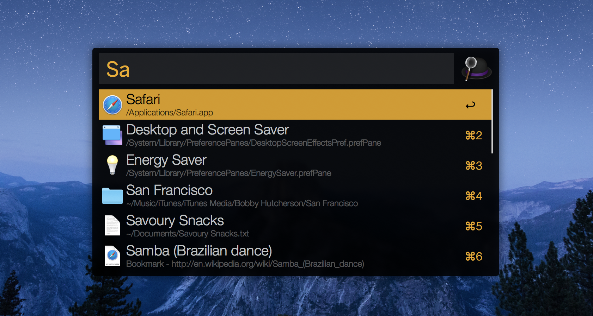
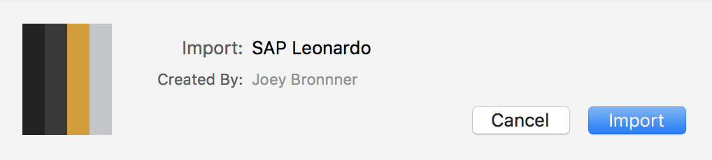

# SAP Leonardo Alfred Theme
*SAP Leonardo (Gold &amp; Black) theme for Alfred 3*

### Preview

### Step 1: download 

You only have to download the file **sap-leonardo-theme.alfredappearance**.

### Step 2: install

Once downloaded, double click on the file and click on **import** *(see below)*

Enjoy 👍
